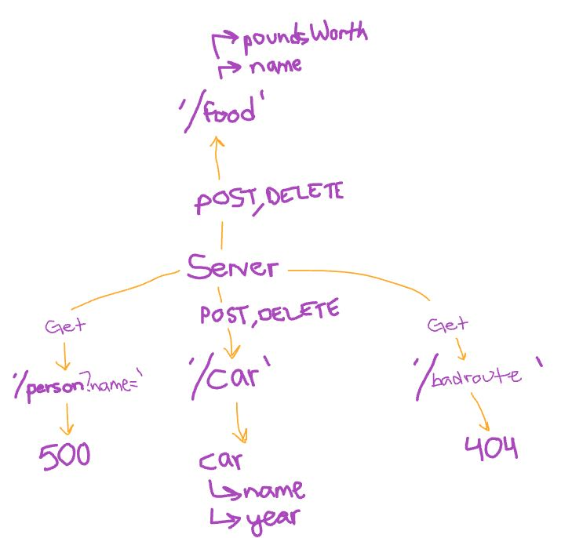

# basic-api-server

Build a REST API using Express, by creating a proper series of endpoints that perform CRUD operations on a database, using the REST standard.

---

## Routes

### /car

* No parameters
* JSON response: {"name":"value"}

--- 

## URLs

[Deployed page here](https://timegorov-basic-api-server.herokuapp.com)
